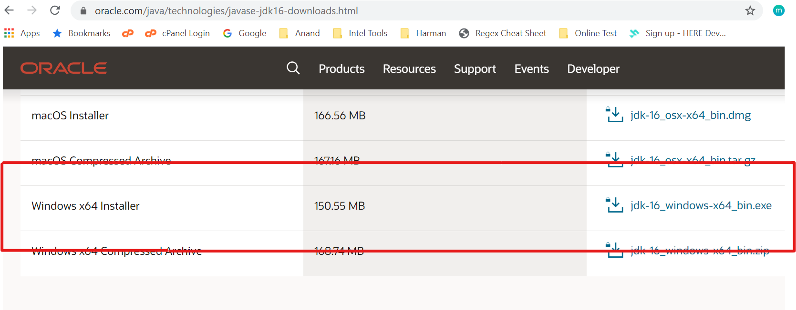
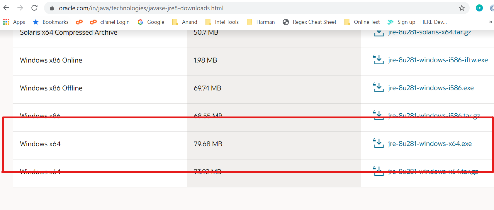
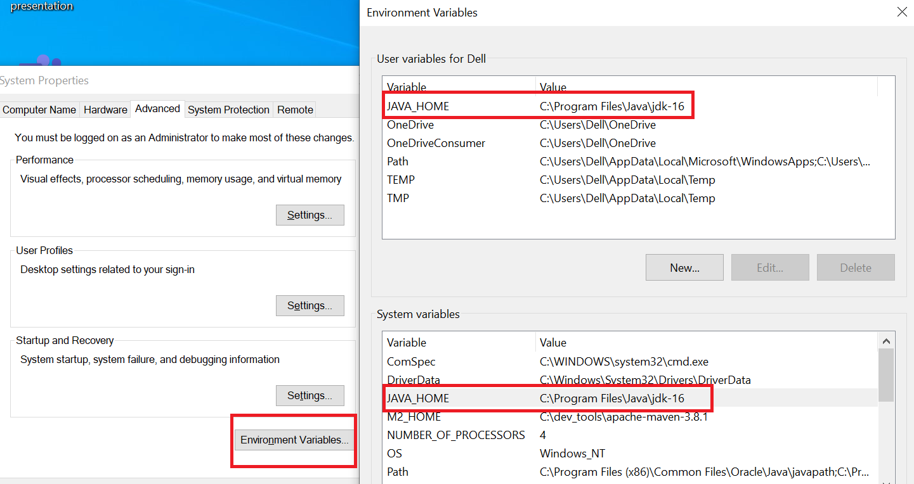
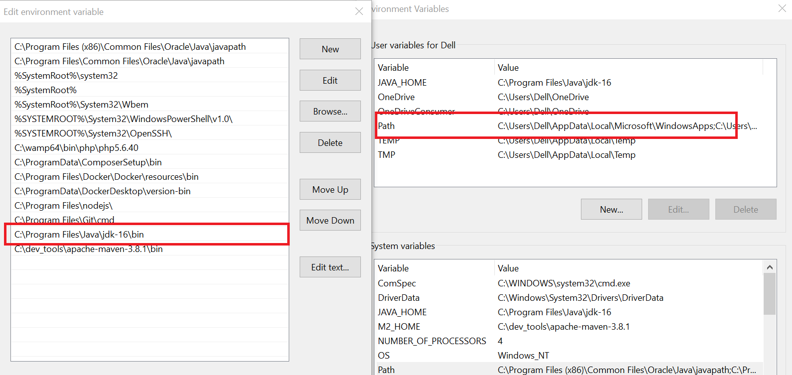
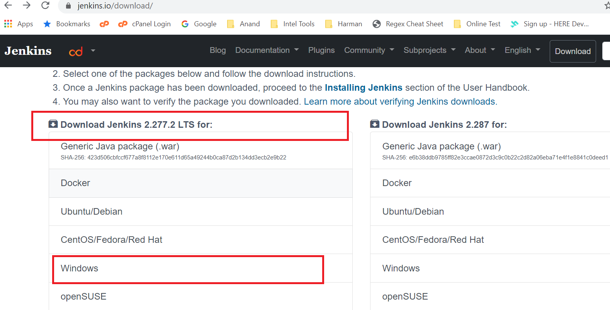
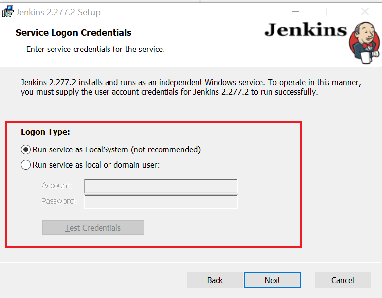
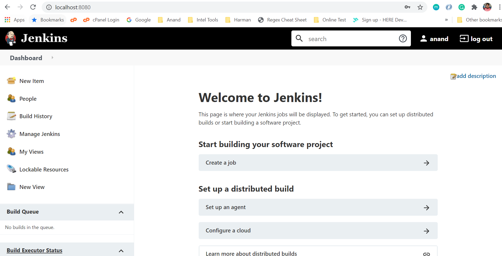

# CI/CD With Jenkins in Windows Machine
“CI/CD” is a practices of Continuous Integration (CI) and Continuous Delivery (CD).

### Before moving to CI/CD we need to install tools
    
    Jenkins
    Docker

### Jenkins Installation Guide

For Jenkins installation we need Java environment.

#### Step 1: JDK (JAVA DEVELOPMENT KIT)  and JRE (JAVA RUNTIME ENVIROMENT ) DOWNLOAD & INSTALL 

https://www.oracle.com/java/technologies/javase-jdk16-downloads.html
    

https://www.oracle.com/in/java/technologies/javase-jre8-downloads.html

Note: Install with default settings.

### Step 2: Set Java SDK path in Environment Variables

    copy JDK path C:\Program Files\Java\jdk-16 

* Add new Variable JAVA_HOME in User Variable and System Variable

    Copy JAVA bin folder C:\Program Files\Java\jdk-16\bin

* Add bin path system variable path (inside environment variable)

### Step 3: Jenkins Download & Install

https://www.jenkins.io/download/

    choose Jenkins *.***.* LTS and windows

#### Jenkins Installations
     
Run Jenkins Windows installer and follow the steps

Installation get Service Logon Credential window need to choose Logon Type

2 Option Given
* Run Service as Local System (i choose this option)
* Run Service as local or domain user ( https://stackoverflow.com/questions/63410442/jenkins-installation-windows-10-service-logon-credentials)
    

After Successful installation new page open in a browser at localhost:8080

then follow the steps mentions in the page. once you did all the configuration part like user creation. You will redirect to Jenkins Dashboard.

    

